# PLEASE READ THE INSTRUCTIONS BELOW THOROUGHLY AND WATCH THE VIDEO LINKED BELOW BEFORE ASKING QUESTIONS

Assembly video can be found here: 

A video showing how to order the PCB can be found here: 

For further questions and resources join the [Discord](https://discord.gg/FcNPHcn7kz) server 

| Navigation |
| ------------------------ |
| [File Outline](#file-outline) |
| [Print Settings and Materials](#print-settings-and-materials) |
| [Printed Parts](#printed-parts) |
| [Impact Fuse BOM](#impact-fuse-bill-of-materials) |
| [Timed Fuse BOM](#impact-fuse-bill-of-materials) |
| [Impact Fuse Assembly](#impact-fuse-assembly) |
| [Timed Fuse Assembly](#timed-fuse-assembly) |
| [Body Assembly and Function](#body-assembly-and-function) |
| [Additional Material Info](#additional-material-info) |

# File Outline:
Files are organized into assigned folders and named with association to each component  

- Numbers indicate the diamter of the body
- Files ending with a **P** are primer bodies
- Files ending with an **8** are 8-shot cap bodies
- Files ending with a **S** are adult,thunder, super snap bodies
- For the 38 bodies, an ending with **F** is a hexagon capped version of the body
- For the 38 bodies, an ending with **L** is a longer body
- Spoons are matched by the body diameter number (38, 55, 61, etc.)
- The thumb spoon is universal

# Print Settings and Materials:
It is critical that your printer and filament are tuned correctly for good results. Please verify that your printer is printing accurate parts. Additional slicer hacks to resolve fitment issues will be demonstrated later in the instructions.

## Slicer Settings:
- 0.20mm layer height or smaller for the bodies and fuses
- 0.16mm layer height or smaller for the cam, bolt guide, and spring plate
- Smaller layers may yield more accurate dimensions
- 2mm Wall, Top, and Bottom Thickness (5 walls for 0.4mm nozzle)
- 35% Gyroid or Cubic Infill
- For the TPU spoons 2mm wall, top and bottom layers with 100% infill. The wall thickness is important for the layer orientation.

## Material:
- Use PLA+ For all components excluding the spoons
- For the spoons use 95A TPU. It is critical that you use this variant of TPU. Other durometers will yield varying results. It is highly recommended that you use TPU spoons. They will yield drastically better performance and impact strength.
- The bottoms of the snap bodies may be printed from TPU.
- **DO NOT** use ABS, ASA, or PETG. These materials exhibit weaker layer adhesion and will break easily. Carbon Fiber or Glass Fiber composite materials will exhibit weaker layer adhesion as well and are not recommended for the primary body and fuse components
- Better materials will be discussed at the end of the document; however it is recommended that you use PLA and standard TPU 95A to establish a baseline.

## Print Orientation:
- For both the Impact and Timed Fuse place the bottom on the build plate. Support will not be required, they are built in.
- All bodies will be printed with their bottoms on the build plate. Support is not needed. The 55S body is the only exception and will need support.
- The spoons can be printed sideways without the need for support.
- The bolt guide, timer cam, and spring plate can be printed without support.

# Printed Parts:
The tables below outline the printed parts necissary for each core component. You will need a fuse type and a body type. All fuses and bodies are interchangable. Links are to the corresponding file folders.
## Printed Parts for Impact Fuse:
| Part | QTY |
| --- | --- |
| [Fuse](ImpactFuse/FuseV4.5.STL) | 1 |
| [Bolt Guide](ImpactFuse/BoltGuide.STL) | 1 |
| [Spring Plate](ImpactFuse/SpringPlate.STL) | 1 |
| [Spoon](ImpactFuse/Spoons) | 1 |

## Printed Parts for Timed Fuse:
| Part | QTY |
| --- | --- |
| [Fuse](TimedFuse/PCBFuseV4.5.STL) | 1 |
| [Bolt Guide](TimedFuse/BoltGuide.STL) | 1 |
| [Spring Plate](TimedFuse/SpringPlate.STL) | 1 |
| [Cam](TimedFuse/Cam.STL) | 1 |
| [Cap](TimedFuse/Cap.STL) | 1 |

## Printed Parts for Primer Body:
| Part | QTY |
| --- | --- |
| [Body](PrimerBody) | 1 |

## Printed Parts for Snap Body
| Part | QTY |
| --- | --- |
| [Top](SnapBody/Top) | 1 |
| [Bottom](SnapBody/Bottom) | 1 |

## Printed Parts for 8-Cap Body
| Part | QTY |
| --- | --- |
| [Body](8CapBody) | 1 |
| [Retainer](8CapBody/Retainer.STL) | 1 |

# Impact Fuse Bill of Materials:
## Please **VERIFY** that you are ordering the same component listed below. The links do not direct you to the exact size/specification you will need.

| Item | Quantity | Amazon | ALiExpress | Notes |
| ---- | -------- | ------ | ----------- | ------ |
| M4x40mm SHCS Half Thread | 1 | [link](https://www.amazon.com/dp/B0DDKFXLC5?ref_=ppx_hzsearch_conn_dt_b_fed_asin_title_1) | [link](https://www.aliexpress.us/item/3256802084429657.html?spm=a2g0o.detail.pcDetailTopMoreOtherSeller.1.6f82ZPX0ZPX0kQ&gps-id=pcDetailTopMoreOtherSeller&scm=1007.40050.354490.0&scm_id=1007.40050.354490.0&scm-url=1007.40050.354490.0&pvid=2657d297-fe94-4c6a-a7d7-3aed59752187&_t=gps-id:pcDetailTopMoreOtherSeller,scm-url:1007.40050.354490.0,pvid:2657d297-fe94-4c6a-a7d7-3aed59752187,tpp_buckets:668%232846%238116%232002&pdp_ext_f=%7B%22order%22%3A%22688%22%2C%22eval%22%3A%221%22%2C%22sceneId%22%3A%2230050%22%7D&pdp_npi=4%40dis%21USD%211.10%211.05%21%21%211.10%211.05%21%402151e6dc17399251117425329eb501%2112000019845613095%21rec%21US%212397384802%21XZ&utparam-url=scene%3ApcDetailTopMoreOtherSeller%7Cquery_from%3A) | Main Bolt |
| M3x30mm SHCS | 1 | [link](https://www.amazon.com/M3x30mm-Socket-Screws-Thread-Suspension/dp/B0F31RVVGR/ref=sr_1_3?sr=8-3) | [link](https://www.aliexpress.us/item/2251832624557792.html?spm=a2g0o.order_list.order_list_main.172.62f11802i8AwSc&gatewayAdapt=glo2usa) | Spoon Bolt |
| 12mm OD x 40mm 1.2mm Diameter Spring | 1 | [link]() | [link]() | Primary Spring See Comments Below |
| 8mm OD x 40mm 0.8mm Diameter Spring | 1 | [link]() | [link]() | Secondary Spring See Commenst Below |
| M3x25mm Countersunk Self-Tapping Screw | 4 | [link]() | [link]() | Fuse Reinforcement |
| 25mm/1" Keyring | 1 | [link]() | [link]() | |
| M2.5x35mm Cotter Pin | 1 | [link]() | [link]() | |
| M3 Brass Heat Insert 5mmODx4mmL | 1 | [link]() | [link]() | Not necissary, only for increased durability |

Primary springs ordered from other locations may have differing coil counts. The recommended coil count is ~10-11, however, some experimentation may be needed. Both springs linked will work without modification. In the case the spring is unable to compress enough, either cut and stretch the spring, or purchase a shorter length and stretch to fit. If you find your springs too weak, increase in length. I recommend purchasing a few varying lengths or further discuss with others on the discord to find a good spring.  

The secondary spring is to add spring strength for the primer and 8-cap and is not necessary for the snap rounds.  

Springs will lose their strength over time and will need to be replaced. Avoid leaving the fuses cocked over long periods of time, this will rapidly decrease their lifespan.

# Timed Fuse Bill of Materials:
## Please **VERIFY** that you are ordering the same component listed below. The links do not direct you to the exact size/specification you will need.

| Item | Quantity | Amazon | ALiExpress | Notes |
| ---- | -------- | ------ | ----------- | ------ |
| M4x40mm SHCS Half Thread | 1 | [link](https://www.amazon.com/dp/B0DDKFXLC5?ref_=ppx_hzsearch_conn_dt_b_fed_asin_title_1) | [link](https://www.aliexpress.us/item/3256802084429657.html?spm=a2g0o.detail.pcDetailTopMoreOtherSeller.1.6f82ZPX0ZPX0kQ&gps-id=pcDetailTopMoreOtherSeller&scm=1007.40050.354490.0&scm_id=1007.40050.354490.0&scm-url=1007.40050.354490.0&pvid=2657d297-fe94-4c6a-a7d7-3aed59752187&_t=gps-id:pcDetailTopMoreOtherSeller,scm-url:1007.40050.354490.0,pvid:2657d297-fe94-4c6a-a7d7-3aed59752187,tpp_buckets:668%232846%238116%232002&pdp_ext_f=%7B%22order%22%3A%22688%22%2C%22eval%22%3A%221%22%2C%22sceneId%22%3A%2230050%22%7D&pdp_npi=4%40dis%21USD%211.10%211.05%21%21%211.10%211.05%21%402151e6dc17399251117425329eb501%2112000019845613095%21rec%21US%212397384802%21XZ&utparam-url=scene%3ApcDetailTopMoreOtherSeller%7Cquery_from%3A) | Main Bolt |
| 12mm OD x 40mm 1.2mm Diameter Spring | 1 | [link]() | [link]() | Primary Spring See Comments Below |
| 8mm OD x 40mm 0.8mm Diameter Spring | 1 | [link]() | [link]() | Secondary Spring See Commenst Below |
| M2.5x25mm Countersunk Self-Tapping Screw | 4 | [link]() | [link]() | Fuse Cap Fastners and Reinforcement |
| 25mm/1" Keyring | 1 | [link]() | [link]() | |
| M2.5x35mm Cotter Pin | 1 | [link]() | [link]() | |
| Motor 12V 30RPM | 1 | [link]() | [link]() | **DO NOT ORDER THE WRONG MOTOR** See Comments Below To ensure you order the correct motor |
| 100mAh 3.7V Li-Po w/ JST PH2.0mm Connector | 2 | [link]() | [link]() | See the Image Below for Battery Space Measurements |
| Male JST PH2.00mm 3P Connector | 1 | [link]() | [link]() | Charger Cable |
| Male JST XH2.54mm 3P Connector | 1 | [link]() | [link]() | This is for charging the 2S Li-Po in the fuse. I recommend purchasing a 2S Li-Po balance lead and crimping the JST PH2.0mm connector to the end. Otherwise, you can crimp the connectors on both ends. |
| M2.5x3mm Set Screw | 1 | [link]() | [link]() | Timer Cam |
| Limit Switch SPDT | 1 | [link]() | [link]() | Ensure is a side mount switch and facing in the correct orientation The [switch](Images/switch.JPEG) is imaged below |
| PCB | 1 | | | PCB [Files]() are above A [video]() showing how to order the board is linked above |
| Female JST PH2.0mm 2P Vertical Header | 2 | [link]() | [link]() | Battery PCB Header |
| Female JST PH2.0mm 3P Horizontal Header | 1 | [link]() | [link]() | Battery PCB Charge Port Header |

**DO NOT ORDER THE WRONG MOTOR.** It is Very important that you purchase a 12V-30rpm/6V-15rpm motor. The gearbox is 12.5mm vs the standard 9mm. The gearbox has a 1:1000 ratio. Please be careful to order the correct motor others will not work. I recommend ordering from the Alibaba link, please specify the **“KGM12-N20-C. 6V 1/1000 reduction ratio”** when ordering.  

Primary springs ordered from other locations may have differing coil counts. The recommended coil count is ~10-11, however, some experimentation may be needed. Both springs linked will work without modification. In the case the spring is unable to compress enough, either cut and stretch the spring, or purchase a shorter length and stretch to fit. If you find your springs too weak, increase in length. I recommend purchasing a few varying lengths or further discuss with others on the discord to find a good spring.  

The secondary spring is to add spring strength for the primer and 8-cap and is not necessary for the snap rounds.  

Springs will lose their strength over time and will need to be replaced. Avoid leaving the fuses cocked over long periods of time, this will rapidly decrease their lifespan.
Battery compartment dimensions are below in millimeters. You will have to explore options for batteries since listings change per country. Verify that it has a JST PH 2.0mm connector or crimp your own.

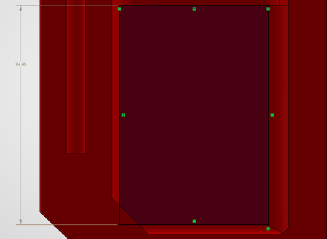

# Impact Fuse Assembly:
### It is recommended to watch the assembly video as well

1. To start for the primer version only, grind the end of the fuse screw (m4x40mm) to a bevel as shown in the image below. Do not sharpen the tip this will puncture the primer. A point around 3mm in diameter is ideal.  
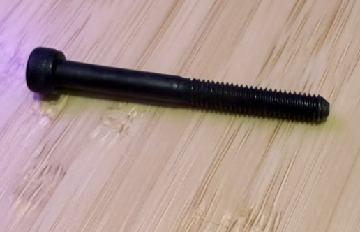

2.	Press the bolt guide onto the M4x40mm bolt. This will likely take some force. A tool is included to help press the guide on. It is recommended to also use glue to ensure that it will not separate under prolonged use. Verify that the guide is also sitting relatively straight on the bolt. The fitment of the guide and bolt in the fuse is not critical to the reliability of the grenade like V3; however, it will perform best with a good fitment.  
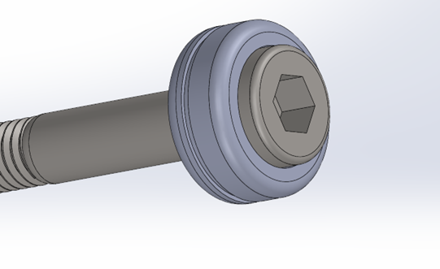
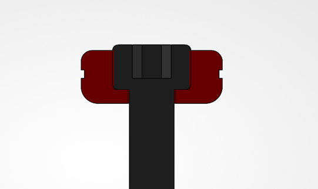

3.	Secure the main screw, primary, and secondary springs in the fuse with the spring retainer. For use with primers ensure that the bolt sticks out ~2mm past the spring retainer as seen in the photo below.  
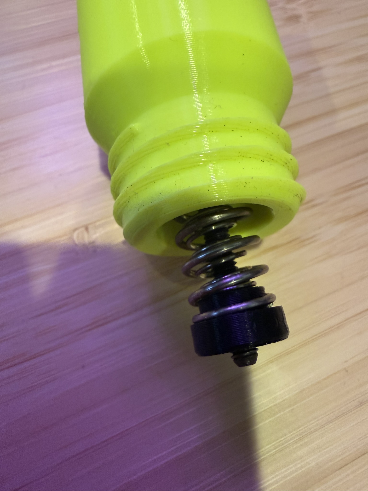

4.	Insert four m3x25mm self-tapping screws for reinforcement.  

5.	The spoon can now be secured by the m3x30mm screw. The flexible TPU spoons will yield dramatically better results over normal pla+. If necessary, the width of the spoon can be increased or decreased in your slicer by modifying its z scale. The fuse performs best when the spoon moves freely without resistance. The tab on the inside face of the spoon can also be trimmed or sanded for increased sensitivity.  
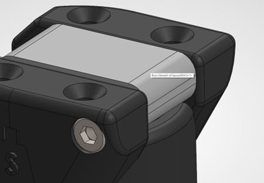
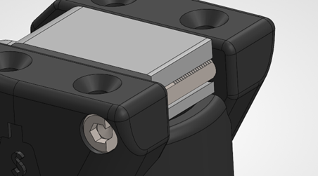
  
Trim or sand the Tab for increased sensitivity  
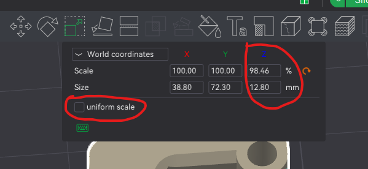  
Bambu Studio Spoon Width Adjustment  

6.	In order to prime the fuse, the m4 screw needs to be pushed up and towards the rear as shown in the image below. The spoon will then be lowered in order to hold the screw from dropping.  
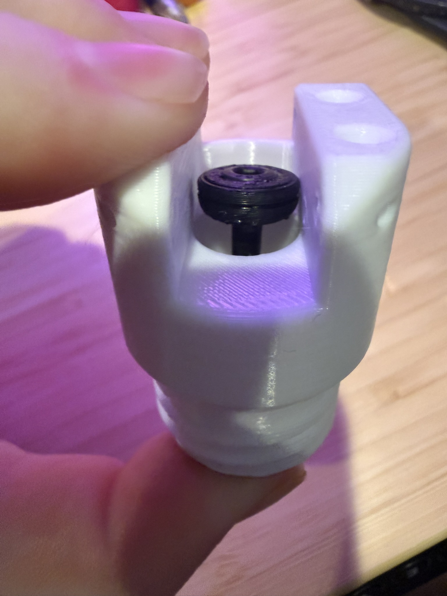

The screw is not supposed to catch on the top and should free fall unless something is blocking it. There is no spring on the spoon, that is counter intuitive to the design. The spoon is blocking the screw from falling into the hole. The fuse will trigger when the spoon moves away from the bolt guide. This can be accomplished with a hard impact or simply moving the spoon. Again, adjusting the tab on the spoon by trimming or sanding adjusts the force required for the spoon to move out of the way. Be careful to not make it too sensitive otherwise the force used to throw is enough to trigger the fuse.  

Throw the device underhand. If thrown overhand, hold it in the position shown below. Throwing in this orientation reduces the force on the fuse mechanism to avoid triggering in flight or upon release.  
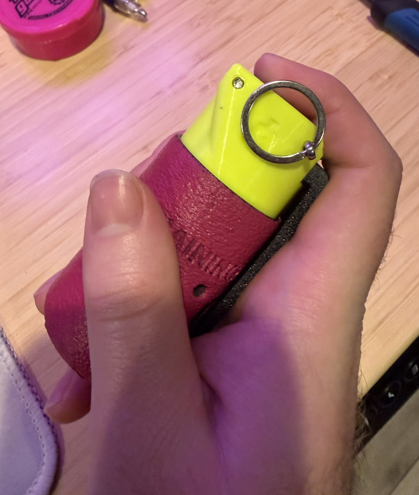

# Timed Fuse Assembly:
### It is recommended to watch the assembly video as well

1. To start for the primer version only, grind the end of the fuse screw (m4x40mm) to a bevel as shown in the image below. Do not sharpen the tip this will puncture the primer. A point around 3mm in diameter is ideal.  

2.	Press the bolt guide onto the M4x40mm bolt. This will likely take some force. A tool is included to help press the guide on. It is recommended to also use glue to ensure that it will not separate under prolonged use. Verify that the guide is also sitting relatively straight on the bolt. The fitment of the guide and bolt in the fuse is not critical to the reliability of the grenade like V3; however, it will perform best with a good fitment.  

3.	Secure the main screw, primary, and secondary springs in the fuse with the spring retainer. For use with primers ensure that the bolt sticks out ~2mm past the spring retainer as seen in the photo below.  

4.	Trim the switch lever as shown below. The switch will not fit into the fuse body of the lever is not trimmed. Remove the built in support from the fuse body.
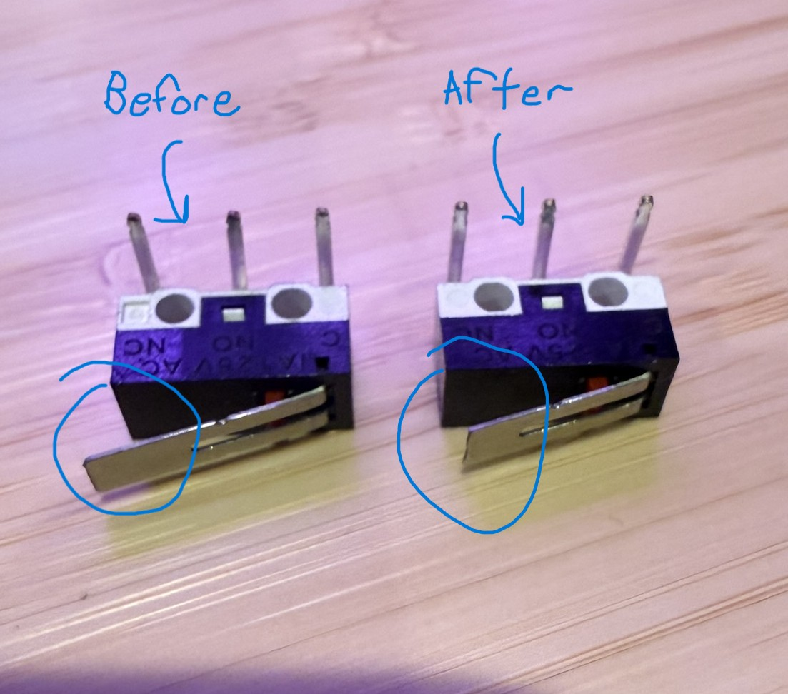

5.	Solder the PCB as Imaged below. Trim the extra pin length after soldering. **GOING FORWARD DO NOT PRESS THE BUTTON UNTIL INSTRUCTED TO DO SO**  
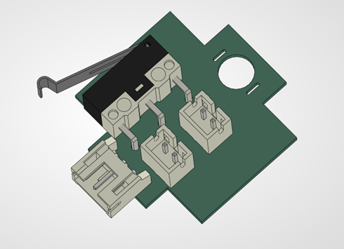
  
  
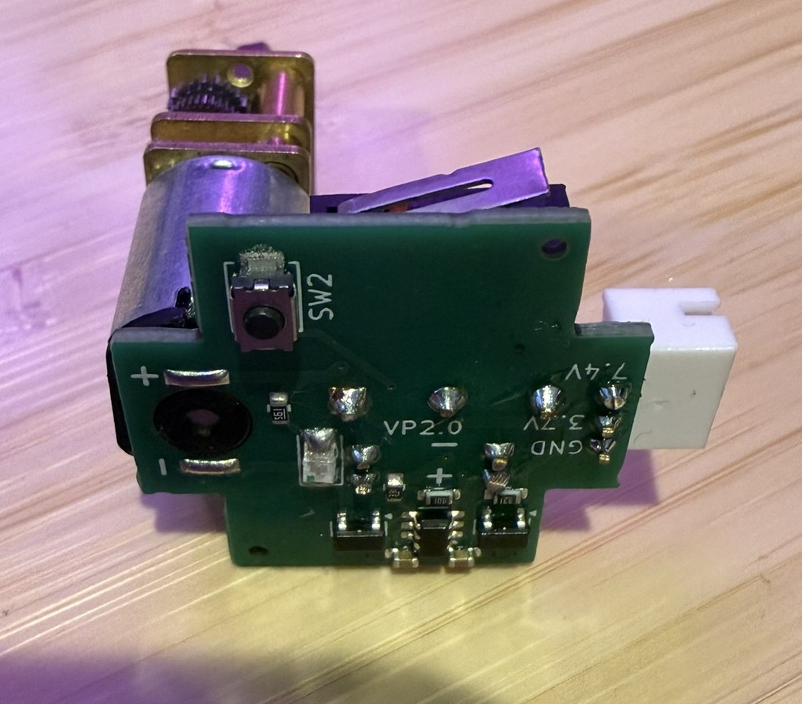   
Trim the Excess Pin Lenght from the Headers and Switch to avoid touching the cap

6.	Plug the Batteries in the order labeled. **VERIFY THE POLARITY IS CORRECT.** It is critical that you do this correctly or risk harming the board. When disassembling, unplug the batteries in the reverse order (#2 first then #1). AGAIN, **DON’T PRESS THE BUTTON.**

7.	Add the screw to the cam. Thread the set screw all the way through to remove additional material. Leave screw out until later. Verify the cam fits the motor shaft.  

8.	Insert the PCB assembly and cam into the fuse. You can use a pin to hold the cam in the center like imaged below. Ensure the notch on the cam is facing down. Rotate the cam to match the motor shaft to insert fully. Ensure the battery wires are orientated as shown in the image and the wires are not being pinched. There is a small cutout for the wires under the switch.
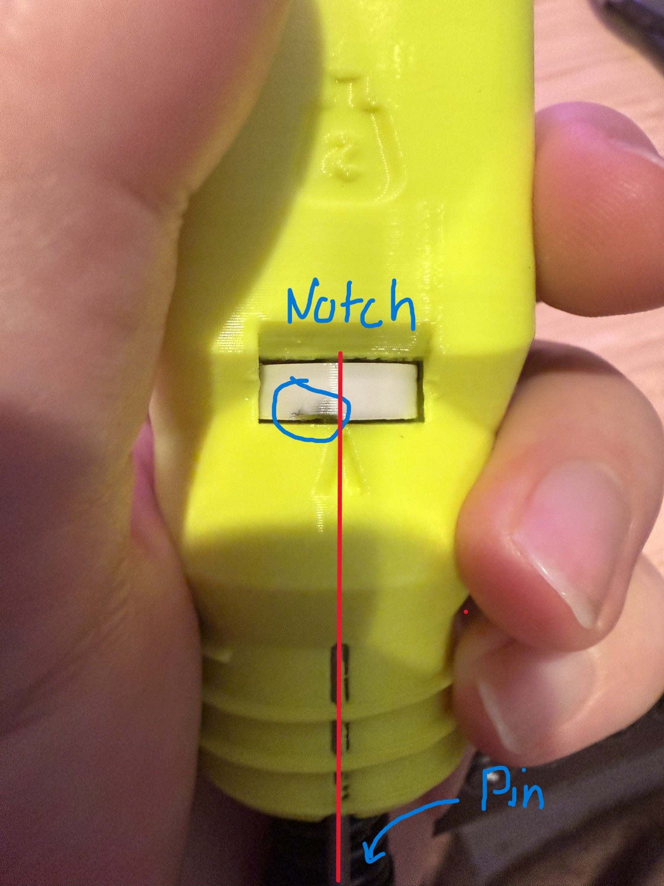  
Note the Pin inserted from the bottom holding the cam in place and the cam notch is facing down

  
Make sure the wires for the battery on the left are exiting through the cutout to prevent them from getting pinched by the switch  

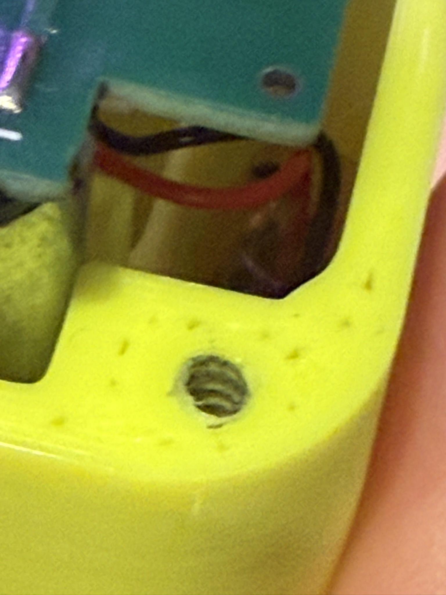  
Right Battery  

  
Left Battery  

9.	Now press the button to reset the battery protection circuit. The motor should now turn, and you can stop the motor by inserting the pin from the front. The motor will now turn continuously if there is nothing pressing onto the switch. If the board does not power on ensure that your batteries are charged and they are installed in the correct order/polarity. Fasten the cap once you confirm the motor is turning. Stop the motor when the cam is located with the set screw facing out. Install the set screw. Using superglue on the set screw is encouraged.
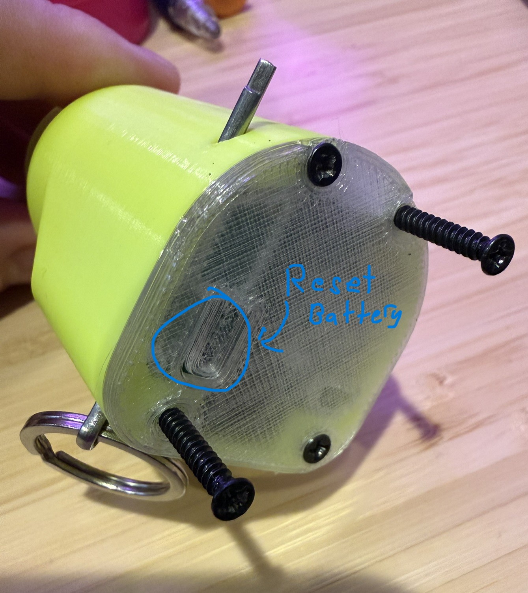

10.	Finally, to use the timed fuse stop the cam when the notch lines up with the arrow on the fuse body. Push the main bolt up and to the rear like you would the impact fuse. While holding it up and to the rear, advance the cam a small amount to catch or limit the bolt from falling. Now when the pin is pulled the cam will rotate and the bolt will eventually fall. The timing can easily be reduced by advancing the cam further when setting. Re-insert the pin to stop the mechanism upon retrieval.
  
Align the Cam Notch with the Arrow to ALlow the Bolt to Move Up

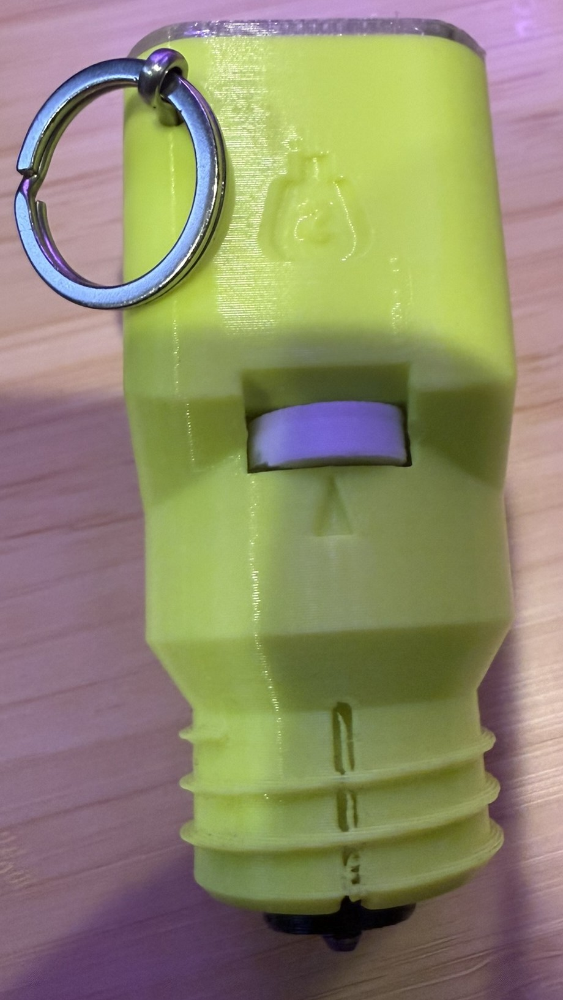  
Note the Bolt is all the way up and the cam has been advanced preventing it from falling  

  

11.	To charge the fuse use a 2s lipo charger and the charging port on the side of the fuse. Below is a picture of a charging cable with labeled pins. Ensure that your wires are correct. There is a pinout on the PCB for further confirmation. If your charger requires you to plug in the main connector in addition to the balance lead, add two additional wires and a connector of your choice (Deans, xt60, banana, etc.) like shown in green.

### Notes:
- Do not insert the pin in the back, it will break the switch. Insert only from the front.
-	The fuse will continuously spin until the switch is depressed with the pin.
-	I measured over 1h 30min runtime. This is far more than I’ve ever needed and will allow you many uses given you retrieve it after throwing it in a reasonable time.
-	In case the batteries run out, the protection circuit will stop the batteries from being discharged. Re-charge the batteries and reset the protection circuit with the button on top.
-	If the motor spins freely in the cam, the D shaped hole becomes rounded, use glue when inserting the set screw. If the problem still occurs print the cam using a more rigid material such as Polycarbonate or a fiber reinforced material.  

# Body Assembly and Function:
For the Primer Bodies. The Primer will be loaded in the location outlined in the photo below. It can be pushed out after use from the bottom of the body. If the hole is not the right size, I suggest using x-y hole compensation in your slicer.  
  
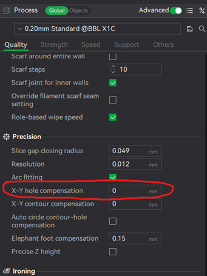  
Bambu Studio X-Y Hole Compensation  

For the 8-shot cap body, the 8-shot cap can then be placed over the retainer then placed in the body as seen below.  
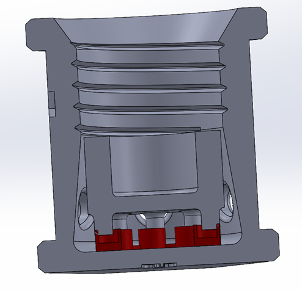  

For the Adult/Super Snap body, Remove the built in support.  
  

Insert the snaps as shown  
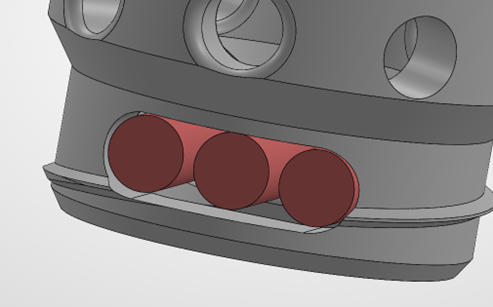  

The bottom can then be screwed on to secure the snaps from falling out  
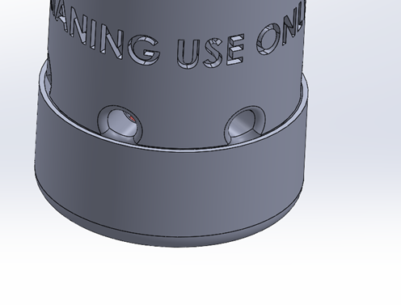  

# Additional Material Info:
Begin testing with PLA and TPU 95A before experimenting with alternative materials. When changing materials, modify only one variable at a time to accurately identify the source of any issues.  

## Fiber-Reinforced Materials (Not Recomended)
Avoid fiber-reinforced filaments such as carbon fiber and glass fiber blends. While these materials increase rigidity, they also make parts significantly more brittle. Under impact, this high rigidity can cause parts to shatter rather than absorb energy. Additionally, fiber additives reduce layer adhesion, which is critical to the safe and reliable operation of these devices.  

### Exception:
The timer cam is the only component where increased rigidity is beneficial, as it helps prevent the motor shaft hole from rounding out. For this specific part only, a more rigid or fiber-reinforced material may be used.  

## Nylon (Non-Fiber Reinforced)
Non-fiber-reinforced nylon is a significantly better alternative to PLA. Use only raw nylon formulations, such as [Overture Easy Nylon]( https://www.amazon.com/OVERTURE-Filament-Consumables-Polyamide-Dimensional/dp/B087R3M9Z2/ref=sr_1_1_pp?sr=8-1), which offer superior impact absorption and stronger layer adhesion. For optimal performance, annealing printed nylon parts is strongly recommended.  

## TPU 72D or Harder
Through testing, [CC3D 72D TPU](https://www.amazon.com/CC3D-Hardness-Transparent-Toughness-Comparable/dp/B0CFY1S38G/ref=sr_1_4?sr=8-4) has proven to be an excellent material choice. It offers an exceptional balance of rigidity, impact absorption, and layer adhesion. When printed correctly, parts made from this material are extremely durable.  

### Recomended Uses:
- Fuses
- Bodies
- Spoons

This material can produce nearly unbreakable components. However, it does have notable drawbacks:
- It is extremely difficult to print
- It slightly reduces impact fuse sensitivity. This is generally not an issue when the device is used against hard surfaces (e.g., pavement)

### Recomended Slicer Setting for CC3D 72D TPU
To achieve reliable results, use the following settings:
- Dry the filament thoroughly Like nylon and TPU, this material absorbs moisture aggressively.
- Print slowly
Use an enclosed printer Heating is not required, but protection from drafts is essential.
- Outer wall speed: ≤ 40 mm/s
- Inner wall speed: ≤ 60 mm/s
- Avoid crossing walls/perimeters
- Seam position: Nearest
- Wall, top, and bottom thickness: 2 mm
- Infill: ≥ 50% for primer bodies
