# PLEASE READ THE INSTRUCTIONS BELOW THOROUGHLY AND WATCH THE VIDEO LINKED BELOW BEFORE ASKING QUESTIONS

Assembly video can be found here: 

A video showing how to order the PCB can be found here: 

For further questions and resources join the [Discord](https://discord.gg/FcNPHcn7kz) server 

| Navigation |
| ------------------------ |
| [Printed Parts](#printed-parts) |
| [Impact Fuse BOM](#impact-fuse-bill-of-materials) |
| [Timed Fuse BOM](#impact-fuse-bill-of-materials) |
| [Impact Fuse Assembly](#impact-fuse-assembly) |
| [Timed Fuse Assembly](#timed-fuse-assembly) |
| [Body Assembly and Function](#body-assembly-and-function) |
| [Additional Material Info](#additional-material-info) |

# Printed Parts:
The tables below outline the printed parts necissary for each core component. You will need a fuse type and a body type. All fuses and bodies are interchangable. Links are to the corresponding file folders. **Materials are ordered from most to least recomended** If a material is not listed do not use it.
## Printed Parts for Impact Fuse:
| Part | QTY | Slicer Settings | Material | Support |
| --- | --- | --- | --- | --- |
| [Fuse](ImpactFuse/FuseV5.STL) | 1 | ≤ 0.20mm layer height   Wall, top, and bottom thickness: ≥ 2 mm (5 walls for 0.4mm nozzle)   ≥ 35% Gyroid or Cubic Infill | TPU 72D   Nylon   PLA+ | No |
| [Bolt Guide](ImpactFuse/BoltGuideV5.STL) | 1 | ≤ 0.16mm layer height   Wall, top, and bottom thickness: ≥ 2 mm (5 walls for 0.4mm nozzle)   100% Infill | TPU 72D   Nylon | Yes |
| [Spring Plate](ImpactFuse/SpringPlateV5.STL) | 1 | ≤ 0.16mm layer height   Wall, top, and bottom thickness: ≥ 2 mm (5 walls for 0.4mm nozzle)   100% Infill | TPU 72D   Nylon | Yes |
| [Spoon](ImpactFuse/Spoon) | 1 | ≤ 0.20mm layer height   Wall, top, and bottom thickness: ≥ 2 mm (5 walls for 0.4mm nozzle)   100% Infill | TPU72D   TPU 95A | No |

## Printed Parts for Timed Fuse:
| Part | QTY | Slicer Settings | Material | Support |
| --- | --- | --- | --- | --- |
| [Fuse](TimedFuse/PCBPinFuseV5.STL) | 1 | ≤ 0.20mm layer height   Wall, top, and bottom thickness: ≥ 2 mm (5 walls for 0.4mm nozzle)   ≥ 35% Gyroid or Cubic Infill | TPU 72D   Nylon   PLA+ | No |
| [Bolt Guide](ImpactFuse/BoltGuideV5.STL) | 1 | ≤ 0.16mm layer height   Wall, top, and bottom thickness: ≥ 2 mm (5 walls for 0.4mm nozzle)   100% Infill | TPU 72D   Nylon | Yes |
| [Spring Plate](ImpactFuse/SpringPlateV5.STL) | 1 | ≤ 0.16mm layer height   Wall, top, and bottom thickness: ≥ 2 mm (5 walls for 0.4mm nozzle)   100% Infill | TPU 72D   Nylon | Yes |
| [Cam](TimedFuse/CamV5.STL) | 1 | ≤ 0.16mm layer height   Wall, top, and bottom thickness: ≥ 2 mm (5 walls for 0.4mm nozzle)   100% Infill | ABS (CF/GF)   CF/GF Nylon   PLA+ | No |
| [Cap](TimedFuse/CapV5.STL) | 1 | ≤ 0.20mm layer height   Wall, top, and bottom thickness: ≥ 2 mm (5 walls for 0.4mm nozzle)   ≥ 35% Gyroid or Cubic Infill | TPU 72D   Nylon   PLA+ | No 

## Printed Parts for Primer Body:
| Part | QTY | Slicer Settings | Material | Support |
| --- | --- | --- | --- | --- |
| [Body](PrimerBody) | 1 | ≤ 0.20mm layer height   Wall, top, and bottom thickness: ≥ 2 mm (5 walls for 0.4mm nozzle)   ≥ 35% Gyroid or Cubic Infill | TPU 72D   Nylon | No |

## Printed Parts for Multi-Primer Body:
| Part | QTY | Slicer Settings | Material | Support |
| --- | --- | --- | --- | --- |
| [Body](PrimerBody) | 1 | ≤ 0.20mm layer height   Wall, top, and bottom thickness: ≥ 2 mm (5 walls for 0.4mm nozzle)   ≥ 35% Gyroid or Cubic Infill | TPU 72D   Nylon | Yes |
| [Holder](PrimerBody/Holder_X4.STL) | 1 | ≤ 0.16mm layer height   Wall, top, and bottom thickness: ≥ 2 mm (5 walls for 0.4mm nozzle)   ≥ 100% Infill | Nylon   PLA+ | No |

## Printed Parts for Snap Body
| Part | QTY | Slicer Settings | Material | Support |
| --- | --- | --- | --- | --- |
| [Body](SnapBody) | 1 | ≤ 0.20mm layer height   Wall, top, and bottom thickness: ≥ 2 mm (5 walls for 0.4mm nozzle)   ≥ 35% Gyroid or Cubic Infill | TPU 72D   Nylon | Only for 55 Body |
| [Base](SnapBody) | 1 | ≤ 0.20mm layer height   Wall, top, and bottom thickness: ≥ 2 mm (5 walls for 0.4mm nozzle)   ≥ 35% Gyroid or Cubic Infill | TPU 72D   TPU 95A   Nylon | No |

## Printed Parts for 8-Cap Body
| Part | QTY | Slicer Settings | Material | Support |
| --- | --- | --- | --- | --- |
| [Body](CapBody) | 1 | ≤ 0.20mm layer height   Wall, top, and bottom thickness: ≥ 2 mm (5 walls for 0.4mm nozzle)   ≥ 35% Gyroid or Cubic Infill | TPU 72D   Nylon | No |
| [Retainer](CapBody/CapRetainerV5.STL) | 1 | ≤ 0.16mm layer height   Wall, top, and bottom thickness: ≥ 2 mm (5 walls for 0.4mm nozzle)   ≥ 100% Infill | Nylon   PLA+ | No |

# Impact Fuse Bill of Materials:
### Please **VERIFY** that you are ordering the same component listed below. The links do not direct you to the exact size/specification you will need.

| Item | Quantity | Amazon | AliExpress | Notes |
| ---- | -------- | ------ | ----------- | ------ |
| M4x45mm FHCS | 1 | [link](https://www.amazon.com/dp/B0D42CX288) | [link](https://www.aliexpress.us/item/3256807652024221.html?spm=a2g0o.productlist.main.4.15a25a4f75fe3z&aem_p4p_detail=2026031011163815739087074454640000065150&algo_pvid=73506eb1-1620-4582-bb3d-f1fe9614fb67&algo_exp_id=73506eb1-1620-4582-bb3d-f1fe9614fb67-3&pdp_ext_f=%7B%22order%22%3A%2217514%22%2C%22eval%22%3A%221%22%2C%22fromPage%22%3A%22search%22%7D&pdp_npi=6%40dis%21USD%211.82%211.82%21%21%2112.50%2112.50%21%402103128817731665986482093ed351%2112000042428692834%21sea%21US%212397384802%21X%211%210%21n_tag%3A-29919%3Bd%3Ae10e313c%3Bm03_new_user%3A-29895&curPageLogUid=PdFCoulK18x7&utparam-url=scene%3Asearch%7Cquery_from%3A%7Cx_object_id%3A1005007838338973%7C_p_origin_prod%3A&search_p4p_id=2026031011163815739087074454640000065150_1) | Main Bolt |
| M3x30mm SHCS | 1 | [link](https://www.amazon.com/M3x30mm-Socket-Screws-Thread-Suspension/dp/B0F31RVVGR/ref=sr_1_3?sr=8-3) | [link](https://www.aliexpress.us/item/2251832624557792.html?spm=a2g0o.order_list.order_list_main.172.62f11802i8AwSc&gatewayAdapt=glo2usa) | Spoon Bolt |
| 12mm OD x 40mm 1.2mm Diameter Spring | 1 | [link](https://www.amazon.com/dp/B076M2CBSX?ref_=ppx_hzsearch_conn_dt_b_fed_asin_title_2) | [link](https://www.aliexpress.us/item/2255800219014836.html?spm=a2g0o.productlist.main.3.7d435eecoeUJNp&algo_pvid=00c8213d-afce-497f-9eff-b51a30294453&algo_exp_id=00c8213d-afce-497f-9eff-b51a30294453-2&pdp_ext_f=%7B%22order%22%3A%22256%22%2C%22eval%22%3A%221%22%7D&pdp_npi=4%40dis%21USD%212.13%212.13%21%21%212.13%212.13%21%40210318ec17484484505383418eebf5%2112000020555428828%21sea%21US%212397384802%21X&curPageLogUid=xA6IX6j1oLDK&utparam-url=scene%3Asearch%7Cquery_from%3A) | Primary Spring See Comments Below |
| 8mm OD x 30mm 1mm Diameter Spring | 1 | [link]() | [link](https://www.aliexpress.us/item/3256805216136796.html?spm=a2g0o.order_list.order_list_main.56.69a61802vAyFQQ&gatewayAdapt=glo2usa) | Secondary Spring See Commenst Below |
| M4 Nut | 2 | [link](https://www.amazon.com/ZQZ-M4-0-7mm-Stainless-Hardware-Standard/dp/B0CQJJV8Q8/ref=sr_1_1_sspa?s=industrial&sr=1-1-spons&sp_csd=d2lkZ2V0TmFtZT1zcF9hdGY) | [link](https://www.aliexpress.us/item/2255800416538696.html?spm=a2g0o.detail.pcDetailTopMoreOtherSeller.2.3a9fGBTzGBTzpS&gps-id=pcDetailTopMoreOtherSeller&scm=1007.40050.354490.0&scm_id=1007.40050.354490.0&scm-url=1007.40050.354490.0&pvid=712b6b0e-e0c3-48aa-a997-7cb9d9db5a1e&_t=gps-id:pcDetailTopMoreOtherSeller,scm-url:1007.40050.354490.0,pvid:712b6b0e-e0c3-48aa-a997-7cb9d9db5a1e,tpp_buckets:668%232846%238115%232000&pdp_ext_f=%7B%22order%22%3A%2211641%22%2C%22spu_best_type%22%3A%22price%22%2C%22eval%22%3A%221%22%2C%22sceneId%22%3A%2230050%22%2C%22fromPage%22%3A%22recommend%22%7D&pdp_npi=6%40dis%21USD%211.03%211.03%21%21%211.03%211.03%21%40210319b017731671023242410e8d3a%2110000003767007634%21rec%21US%212397384802%21XZ%211%210%21n_tag%3A-29919%3Bd%3A76bd9575%3Bm03_new_user%3A-29895&utparam-url=scene%3ApcDetailTopMoreOtherSeller%7Cquery_from%3A%7Cx_object_id%3A4000602853448%7C_p_origin_prod%3A) | For the Bolt and Spring Guide |
| M3x25mm Countersunk Self-Tapping Screw | 4 | [link]() | [link](https://www.aliexpress.us/item/3256807541973336.html?spm=a2g0o.order_detail.order_detail_item.2.29fef19c59uhcA&gatewayAdapt=glo2usa) | Fuse Reinforcement |
| 25mm/1" Keyring | 1 | [link](https://www.amazon.com/PAXCOO-Keyrings-Split-Keychain-Crafts/dp/B076Q9SSSQ/ref=sr_1_2_sspa?sr=8-2-spons&sp_csd=d2lkZ2V0TmFtZT1zcF9hdGY) | [link](https://www.aliexpress.us/item/3256804511691476.html?spm=a2g0o.order_list.order_list_main.132.62f11802i8AwSc&gatewayAdapt=glo2usa) | |
| M2.5x35mm Cotter Pin | 1 | [link]() | [link](https://www.aliexpress.us/item/3256804075588876.html?spm=a2g0o.order_list.order_list_main.192.62f11802i8AwSc&gatewayAdapt=glo2usa) | |
| M3 Brass Heat Insert 5mmODx4mmL | 1 | [link](https://www.amazon.com/dp/B0F43D2TTH) | [link](https://www.aliexpress.us/item/3256803396040989.html?spm=a2g0o.productlist.main.1.633573ebAcVPMH&algo_pvid=6878ca1f-fa24-4ba8-9a1a-eeb5d47e38e8&algo_exp_id=6878ca1f-fa24-4ba8-9a1a-eeb5d47e38e8-0&pdp_npi=4%40dis%21USD%211.55%211.55%21%21%211.55%211.55%21%40212e520d17346319979675427e8b59%2112000026370649751%21sea%21US%212397384802%21X&curPageLogUid=TNg64ld8GbnZ&utparam-url=scene%3Asearch%7Cquery_from%3A) | Not necissary, only for increased durability |

Primary springs ordered from other locations may have differing coil counts. The recommended coil count is ~10-11, however, some experimentation may be needed. Both springs linked will work without modification. In the case the spring is unable to compress enough, either cut and stretch the spring, or purchase a shorter length and stretch to fit. If you find your springs too weak, increase in length. I recommend purchasing a few varying lengths or further discuss with others on the discord to find a good spring.  

The secondary spring is to add spring strength for the primer and 8-cap and is not necessary for the snap rounds.  

Springs will lose their strength over time and will need to be replaced. Avoid leaving springs compressed over long periods of time, as this will rapidly decrease their lifespan.

# Timed Fuse Bill of Materials:
### Please **VERIFY** that you are ordering the same component listed below. The links do not direct you to the exact size/specification you will need.

| Item | Quantity | Amazon | AliExpress | Notes |
| ---- | -------- | ------ | ----------- | ------ |
| M4x45mm FHCS | 1 | [link](https://www.amazon.com/dp/B0D42CX288) | [link](https://www.aliexpress.us/item/3256807652024221.html?spm=a2g0o.productlist.main.4.15a25a4f75fe3z&aem_p4p_detail=2026031011163815739087074454640000065150&algo_pvid=73506eb1-1620-4582-bb3d-f1fe9614fb67&algo_exp_id=73506eb1-1620-4582-bb3d-f1fe9614fb67-3&pdp_ext_f=%7B%22order%22%3A%2217514%22%2C%22eval%22%3A%221%22%2C%22fromPage%22%3A%22search%22%7D&pdp_npi=6%40dis%21USD%211.82%211.82%21%21%2112.50%2112.50%21%402103128817731665986482093ed351%2112000042428692834%21sea%21US%212397384802%21X%211%210%21n_tag%3A-29919%3Bd%3Ae10e313c%3Bm03_new_user%3A-29895&curPageLogUid=PdFCoulK18x7&utparam-url=scene%3Asearch%7Cquery_from%3A%7Cx_object_id%3A1005007838338973%7C_p_origin_prod%3A&search_p4p_id=2026031011163815739087074454640000065150_1) | Main Bolt |
| 12mm OD x 40mm 1.2mm Diameter Spring | 1 | [link](https://www.amazon.com/dp/B076M2CBSX?ref_=ppx_hzsearch_conn_dt_b_fed_asin_title_2) | [link](https://www.aliexpress.us/item/2255800219014836.html?spm=a2g0o.productlist.main.3.7d435eecoeUJNp&algo_pvid=00c8213d-afce-497f-9eff-b51a30294453&algo_exp_id=00c8213d-afce-497f-9eff-b51a30294453-2&pdp_ext_f=%7B%22order%22%3A%22256%22%2C%22eval%22%3A%221%22%7D&pdp_npi=4%40dis%21USD%212.13%212.13%21%21%212.13%212.13%21%40210318ec17484484505383418eebf5%2112000020555428828%21sea%21US%212397384802%21X&curPageLogUid=xA6IX6j1oLDK&utparam-url=scene%3Asearch%7Cquery_from%3A) | Primary Spring See Comments Below |
| 8mm OD x 30mm 1mm Diameter Spring | 1 | [link]() | [link](https://www.aliexpress.us/item/3256805216136796.html?spm=a2g0o.order_list.order_list_main.56.69a61802vAyFQQ&gatewayAdapt=glo2usa) | Secondary Spring See Commenst Below |
| M4 Nut | 2 | [link](https://www.amazon.com/ZQZ-M4-0-7mm-Stainless-Hardware-Standard/dp/B0CQJJV8Q8/ref=sr_1_1_sspa?s=industrial&sr=1-1-spons&sp_csd=d2lkZ2V0TmFtZT1zcF9hdGY) | [link](https://www.aliexpress.us/item/2255800416538696.html?spm=a2g0o.detail.pcDetailTopMoreOtherSeller.2.3a9fGBTzGBTzpS&gps-id=pcDetailTopMoreOtherSeller&scm=1007.40050.354490.0&scm_id=1007.40050.354490.0&scm-url=1007.40050.354490.0&pvid=712b6b0e-e0c3-48aa-a997-7cb9d9db5a1e&_t=gps-id:pcDetailTopMoreOtherSeller,scm-url:1007.40050.354490.0,pvid:712b6b0e-e0c3-48aa-a997-7cb9d9db5a1e,tpp_buckets:668%232846%238115%232000&pdp_ext_f=%7B%22order%22%3A%2211641%22%2C%22spu_best_type%22%3A%22price%22%2C%22eval%22%3A%221%22%2C%22sceneId%22%3A%2230050%22%2C%22fromPage%22%3A%22recommend%22%7D&pdp_npi=6%40dis%21USD%211.03%211.03%21%21%211.03%211.03%21%40210319b017731671023242410e8d3a%2110000003767007634%21rec%21US%212397384802%21XZ%211%210%21n_tag%3A-29919%3Bd%3A76bd9575%3Bm03_new_user%3A-29895&utparam-url=scene%3ApcDetailTopMoreOtherSeller%7Cquery_from%3A%7Cx_object_id%3A4000602853448%7C_p_origin_prod%3A) | For the Bolt and Spring Guide |
| M2.5x25mm Countersunk Self-Tapping Screw | 4 | [link]() | [link](https://www.aliexpress.us/item/3256807541973336.html?spm=a2g0o.order_detail.order_detail_item.2.29fef19c59uhcA&gatewayAdapt=glo2usa) | Fuse Cap Fastners and Reinforcement |
| 25mm/1" Keyring | 1 | [link](https://www.amazon.com/PAXCOO-Keyrings-Split-Keychain-Crafts/dp/B076Q9SSSQ/ref=sr_1_2_sspa?sr=8-2-spons&sp_csd=d2lkZ2V0TmFtZT1zcF9hdGY) | [link](https://www.aliexpress.us/item/3256804511691476.html?spm=a2g0o.order_list.order_list_main.132.62f11802i8AwSc&gatewayAdapt=glo2usa) | |
| M2.5x35mm Cotter Pin | 1 | [link]() | [link](https://www.aliexpress.us/item/3256804075588876.html?spm=a2g0o.order_list.order_list_main.192.62f11802i8AwSc&gatewayAdapt=glo2usa) | |
| Motor 12V 30RPM | 1 | [link](https://www.amazon.com/uxcell-Micro-Motor-10RPM-Reducer/dp/B01ES98QSG/ref=sims_dp_d_dex_popular_subs_t3_v6_d_sccl_1_5/144-0795767-7342252?psc=1) [link](https://www.amazon.com/DC-Motor-1000-Miniature-3V-12V/dp/B08K9B1W5M/ref=sr_1_2?s=industrial&sr=1-2) | [link](https://www.alibaba.com/product-detail/Quiet-12mm-Ga12-n20-N10-N20_1600287077566.html?spm=a2756.trade-list-buyer.0.0.26b176e99kQC13) | **DO NOT ORDER THE WRONG MOTOR** See Comments Below To ensure you order the correct motor |
| 100mAh 3.7V Li-Po w/ JST PH2.0mm Connector | 2 | [link]() | [link]() | See the Image Below for Battery Space Measurements |
| Male JST PH2.00mm 3P Connector | 1 | [link](https://www.amazon.com/CQRobot-Pieces-Connector-Housing-Adapter/dp/B09YY18S91/ref=sr_1_6?sr=8-6) | [link](https://www.aliexpress.us/item/3256804853397341.html?spm=a2g0o.order_list.order_list_main.5.48851802uVGHT5&gatewayAdapt=glo2usa) | Charger Cable |
| Male JST XH2.54mm 3P Connector | 1 | [link](https://www.amazon.com/Antrader-Silicone-Battery-Extension-Connector/dp/B07TTR598D/ref=sr_1_9?sr=8-9) | [link](https://www.aliexpress.us/item/3256806041022852.html?spm=a2g0o.productlist.main.17.11282dc2dca5YJ&algo_pvid=6174357d-735d-4ebe-9be2-03931edd674a&algo_exp_id=6174357d-735d-4ebe-9be2-03931edd674a-16&pdp_ext_f=%7B%22order%22%3A%221381%22%2C%22eval%22%3A%221%22%2C%22fromPage%22%3A%22search%22%7D&pdp_npi=6%40dis%21USD%213.15%212.78%21%21%213.15%212.78%21%402103122117674827657655348e1b59%2112000036377215915%21sea%21US%212397384802%21X%211%210%21n_tag%3A-29919%3Bd%3A76bd9575%3Bm03_new_user%3A-29895%3BpisId%3A5000000198118901&curPageLogUid=i3oA9edMKvcV&utparam-url=scene%3Asearch%7Cquery_from%3A%7Cx_object_id%3A1005006227337604%7C_p_origin_prod%3A) | This is for charging the 2S Li-Po in the fuse. I recommend purchasing a 2S Li-Po balance lead and crimping the JST PH2.0mm connector to the end. Otherwise, you can crimp the connectors on both ends. |
| M2.5x3mm Set Screw | 1 | [link](https://www.amazon.com/100pcs-Stainless-Socket-Screws-Metric/dp/B01MTM26H0/ref=sr_1_9?sr=8-9) | [link](https://www.aliexpress.us/item/2255800895118752.html?spm=a2g0o.productlist.main.1.75a670adZHPdt9&algo_pvid=9dbe9f2e-2742-405c-be54-74bd010b5e87&algo_exp_id=9dbe9f2e-2742-405c-be54-74bd010b5e87-0&pdp_npi=4%40dis%21USD%211.11%211.11%21%21%211.11%211.11%21%402101f93317237795542268747ea2ed%2110000014240309951%21sea%21US%212397384802%21X&curPageLogUid=pwZFfx0FFiBr&utparam-url=scene%3Asearch%7Cquery_from%3A) | Timer Cam |
| Limit Switch SPDT | 1 | [link]() | [link](https://www.aliexpress.us/item/3256805410237576.html?spm=a2g0o.order_list.order_list_main.59.48851802uVGHT5&gatewayAdapt=glo2usa) | Ensure you get a side mount switch   The metal switch lever will be removed |
| PCB | 1 | | | PCB [Files]() are above A [video]() showing how to order the board is linked above |
| Female JST PH2.0mm 2P Vertical Header | 2 | [link](https://www.amazon.com/CQRobot-Pieces-Connector-Housing-Adapter/dp/B09DP9FZTX/ref=sr_1_6?s=industrial&sr=1-6) | [link](https://www.aliexpress.us/item/3256806894018733.html?spm=a2g0o.productlist.main.10.239d75a3cHkgrz&algo_pvid=b660cd1f-a817-4fb9-9dee-1c064876b326&algo_exp_id=b660cd1f-a817-4fb9-9dee-1c064876b326-9&pdp_ext_f=%7B%22order%22%3A%221513%22%2C%22eval%22%3A%221%22%2C%22fromPage%22%3A%22search%22%7D&pdp_npi=6%40dis%21USD%211.65%211.52%21%21%211.65%211.52%21%402103212517674672627716652e4fa7%2112000039333381505%21sea%21US%212397384802%21X%211%210%21n_tag%3A-29919%3Bd%3A76bd9575%3Bm03_new_user%3A-29895%3BpisId%3A5000000198118901&curPageLogUid=A7DLh0z0RVBh&utparam-url=scene%3Asearch%7Cquery_from%3A%7Cx_object_id%3A1005007080333485%7C_p_origin_prod%3A) | Battery PCB Header |
| Female JST PH2.0mm 3P Horizontal Header | 1 | [link](https://www.amazon.com/CQRobot-Pieces-Connector-Housing-Adapter/dp/B09YY18S91/ref=sr_1_6?sr=8-6) | [link](https://www.aliexpress.us/item/3256804853397341.html?spm=a2g0o.order_list.order_list_main.5.48851802uVGHT5&gatewayAdapt=glo2usa) | Battery PCB Charge Port Header |

**DO NOT ORDER THE WRONG MOTOR.** It is Very important that you purchase a 12V-30rpm/6V-15rpm motor. The gearbox is ~12.5mm vs the standard 9mm. The gearbox has ~1:1000 ratio. Please be careful to order the correct motor, others will not work. I recommend ordering from the Alibaba link, please specify the **“KGM12-N20-C. 12V 1/1000 reduction ratio”** when ordering.  

Primary springs ordered from other locations may have differing coil counts. The recommended coil count is ~10-11, however, some experimentation may be needed. Both springs linked will work without modification. In the case the spring is unable to compress enough, either cut and stretch the spring, or purchase a shorter length and stretch to fit. If you find your springs too weak, increase in length. I recommend purchasing a few varying lengths or further discuss with others on the discord to find a good spring.  

The secondary spring is to add spring strength for the primer and 8-cap and is not necessary for the snap rounds.  

Springs will lose their strength over time and will need to be replaced. Avoid leaving springs compressed over long periods of time, as this will rapidly decrease their lifespan.

Battery compartment dimensions are below in millimeters. You will have to explore options for batteries since listings change per country. Verify that it has a JST PH 2.0mm connector or crimp your own.

# Multi-Primer Bill of Materials:
### Please **VERIFY** that you are ordering the same component listed below. The links do not direct you to the exact size/specification you will need.

| Item | Quantity | Amazon | AliExpress |
| ---- | -------- | ------ | ----------- |
| 3mm OD x 20mm 0.4mm Spring | 1 | [link](https://www.amazon.com/uxcell-Compression-Spring-Stainless-Length/dp/B0C33CBS5Y/ref=sr_1_1_sspa?s=industrial&sr=1-1-spons&sp_csd=d2lkZ2V0TmFtZT1zcF9hdGY) | [link](https://www.aliexpress.us/item/3256805216186612.html?spm=a2g0o.order_list.order_list_main.66.69a61802vAyFQQ&gatewayAdapt=glo2usa) |
| 3.175mm / 1/8" Ball Bearing | 1 | [link](https://www.amazon.com/uxcell-8-inch-Bearing-Stainless-Precision/dp/B07YFXDZQS/ref=sxin_17_pa_sp_search_thematic_sspa?cv_ct_cx=1%2F8%22%2Bbearing&s=industrial&sbo=RZvfv%2F%2FHxDF%2BO5021pAnSA%3D%3D&sr=1-1-6024b2a3-78e4-4fed-8fed-e1613be3bcce-spons&aref=B4bgzxpbdz&sp_csd=d2lkZ2V0TmFtZT1zcF9zZWFyY2hfdGhlbWF0aWM) | [link](https://www.aliexpress.us/item/3256805018276561.html?spm=a2g0o.order_list.order_list_main.61.69a61802vAyFQQ&gatewayAdapt=glo2usa) |
| M3x20mm BHCS | 1 | [link](https://www.amazon.com/iexcell-Thread-Socket-Button-Screws/dp/B0CP49NWYB/ref=sr_1_3?sr=8-3) | [link](https://www.aliexpress.us/item/2251832780910689.html?spm=a2g0o.detail.pcDetailTopMoreOtherSeller.9.3441f91Hf91HYc&gps-id=pcDetailTopMoreOtherSeller&scm=1007.40050.354490.0&scm_id=1007.40050.354490.0&scm-url=1007.40050.354490.0&pvid=030ae71f-b872-4ad4-aca8-7f85ee968ba4&_t=gps-id:pcDetailTopMoreOtherSeller,scm-url:1007.40050.354490.0,pvid:030ae71f-b872-4ad4-aca8-7f85ee968ba4,tpp_buckets:668%232846%238115%232000&pdp_ext_f=%7B%22order%22%3A%2214068%22%2C%22eval%22%3A%221%22%2C%22sceneId%22%3A%2230050%22%2C%22fromPage%22%3A%22recommend%22%7D&pdp_npi=6%40dis%21USD%211.11%211.11%21%21%211.11%211.11%21%4021033d1217731699782175040ecb48%2112000015921238834%21rec%21US%212397384802%21X%211%210%21n_tag%3A-29919%3Bd%3A76bd9575%3Bm03_new_user%3A-29895&utparam-url=scene%3ApcDetailTopMoreOtherSeller%7Cquery_from%3A%7Cx_object_id%3A32967225441%7C_p_origin_prod%3A) |
| M4x5mm Set Screw | 1 | [link](https://www.amazon.com/ZDingTech-110pcs-Screws-Stainless-Hexagon/dp/B0CF299SDT/ref=sr_1_3?sr=8-3) | [link](https://www.aliexpress.us/item/2255800895118752.html?spm=a2g0o.productlist.main.1.75a670adZHPdt9&algo_pvid=9dbe9f2e-2742-405c-be54-74bd010b5e87&algo_exp_id=9dbe9f2e-2742-405c-be54-74bd010b5e87-0&pdp_npi=4%40dis%21USD%211.11%211.11%21%21%211.11%211.11%21%402101f93317237795542268747ea2ed%2110000014240309951%21sea%21US%212397384802%21X&curPageLogUid=pwZFfx0FFiBr&utparam-url=scene%3Asearch%7Cquery_from%3A) |

# Impact Fuse Assembly:
#### It is recommended to watch the assembly video as well

1. To start, for the primer version only, grind the end of the fuse screw (m4x45mm) to a bevel as shown in the image below. Do not sharpen the tip this will puncture the primer. A point around 3mm in diameter is ideal.  
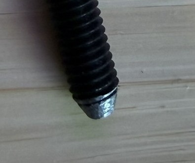

2. Remove any support materail and press an m4 nut into the bolt guide and the spring plate. Screw the m4x45mm screw into to bot guide.   
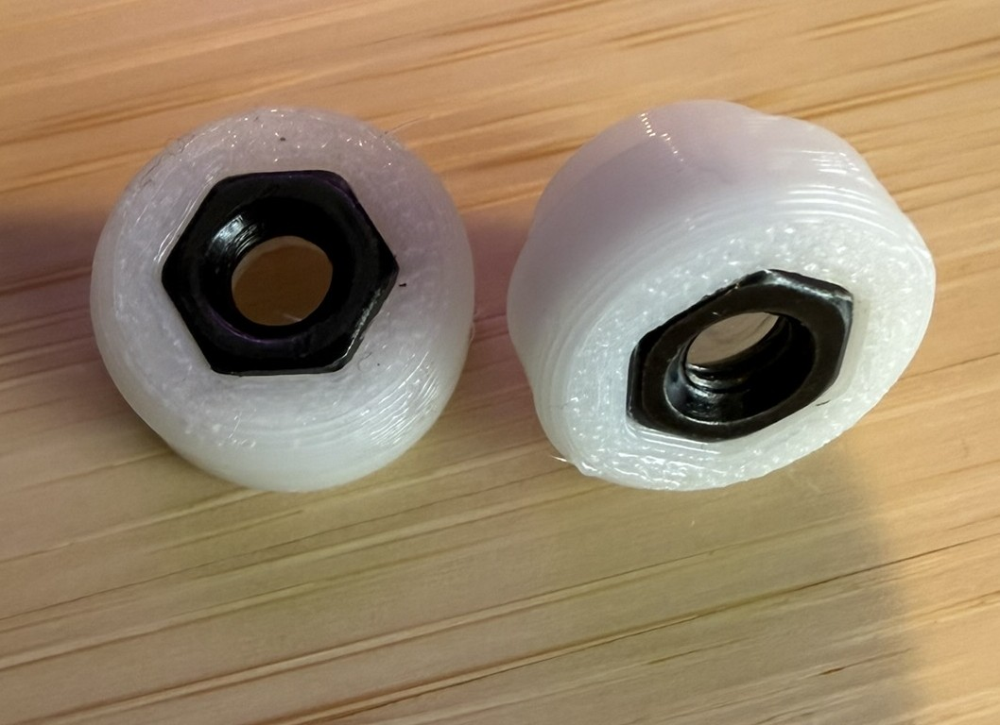  
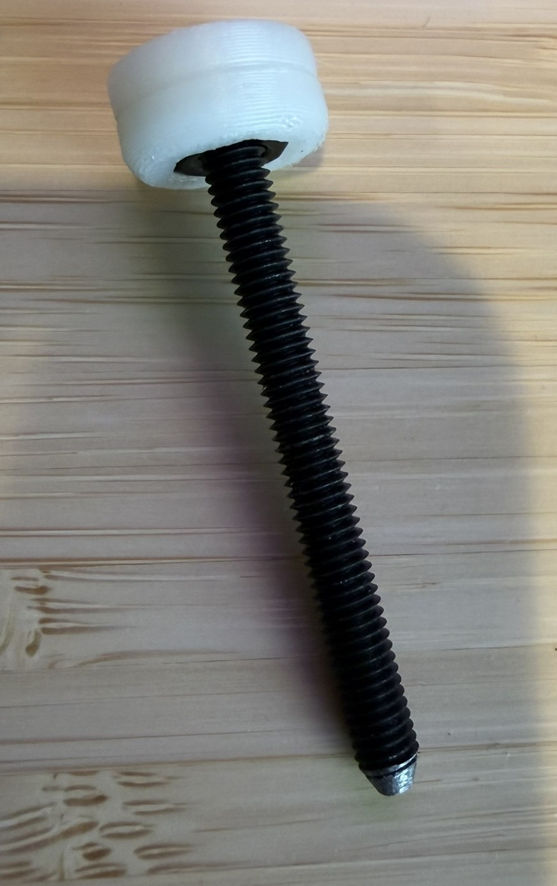  

3. Secure the main screw, primary, and secondary springs in the fuse with the spring retainer. For use with primers ensure that the bolt sticks out ~2mm past the spring retainer as seen in the photo below.  
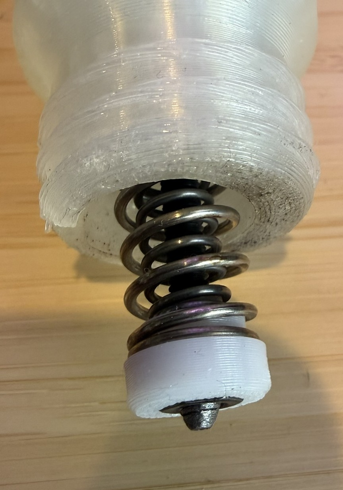

4. Insert four m3x25mm self-tapping screws for reinforcement.  
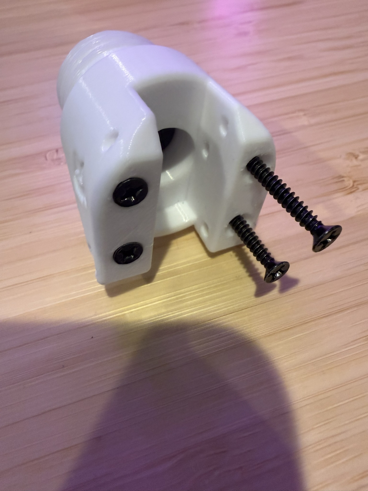

5. The spoon can now be secured by the m3x30mm screw. If necessary, the width of the spoon can be increased or decreased in your slicer by modifying its z scale. The fuse performs best when the spoon moves freely without resistance. The tab on the inside face of the spoon can also be trimmed or sanded for increased sensitivity.  

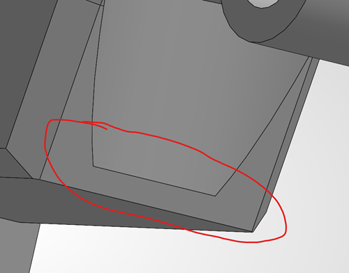  
Trim or sand the Tab for increased sensitivity  
  
Bambu Studio Spoon Width Adjustment  

6.	In order to prime the fuse, the m4 screw needs to be pushed up and towards the rear as shown in the image below. The spoon will then be lowered in order to hold the screw from dropping.  
  
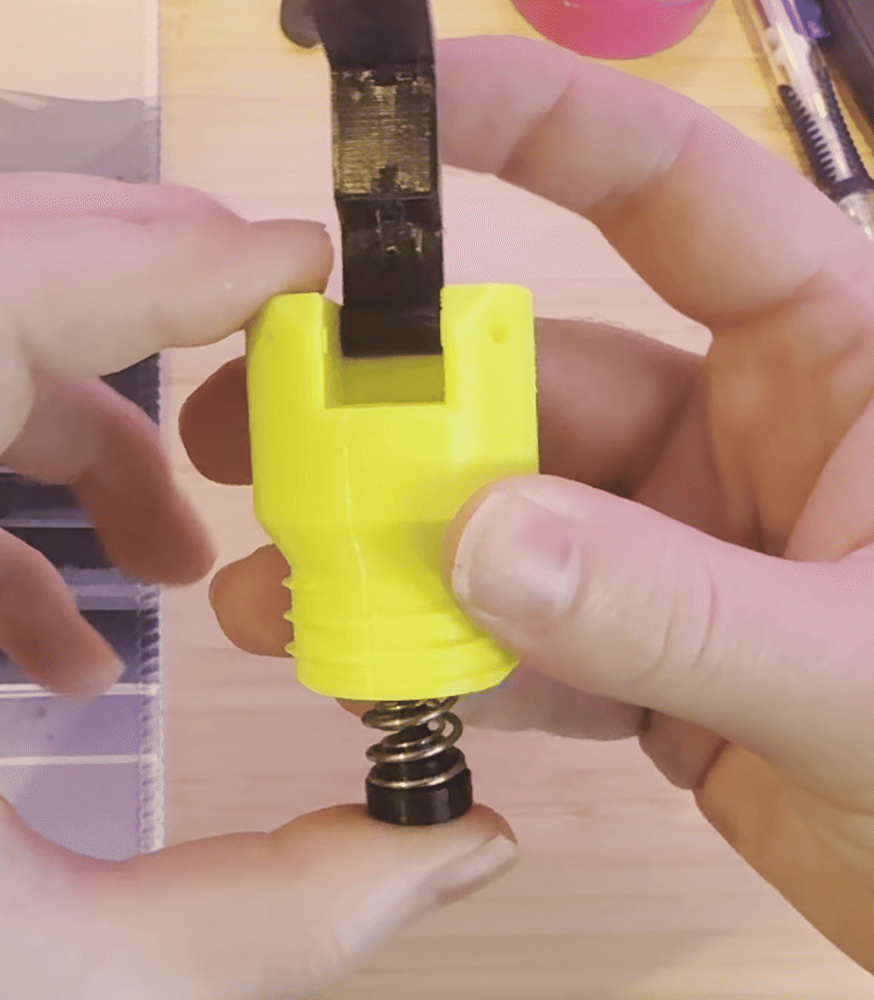

The screw is not supposed to catch on the top and should free fall unless something is blocking it. The spoon is blocking the screw from falling into the hole. The fuse will trigger when the spoon moves away from the bolt guide. This can be accomplished with a hard impact or simply moving the spoon. Again, adjusting the tab on the spoon by trimming or sanding adjusts the force required for the spoon to move out of the way. Be careful to not make it too sensitive otherwise the force used to throw is enough to trigger the fuse.  

Throw the device underhand. If thrown overhand, hold it in the position shown below. Throwing in this orientation reduces the force on the fuse mechanism to avoid triggering in flight or upon release.  

# Timed Fuse Assembly:
### It is recommended to watch the assembly video as well

1. To start, for the primer version only, grind the end of the fuse screw (m4x45mm) to a bevel as shown in the image below. Do not sharpen the tip this will puncture the primer. A point around 3mm in diameter is ideal.  

2. Remove any support materail and press an m4 nut into the bolt guide and the spring plate. Screw the m4x45mm screw into to bot guide.   
  
  

3. Secure the main screw, primary, and secondary springs in the fuse with the spring retainer. For use with primers ensure that the bolt sticks out ~2mm past the spring retainer as seen in the photo below.  

4. Remove the built in support from the fuse body.  
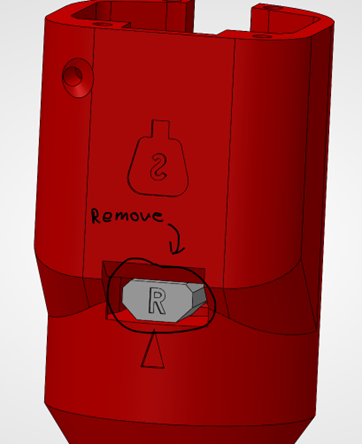  

5.	Solder the Headers/Connectors and Motor to the PCB as Imaged below. Remove the metal lever from the switch. Trim the extra pin length after soldering. **GOING FORWARD DO NOT PRESS THE BUTTON UNTIL INSTRUCTED TO DO SO**  

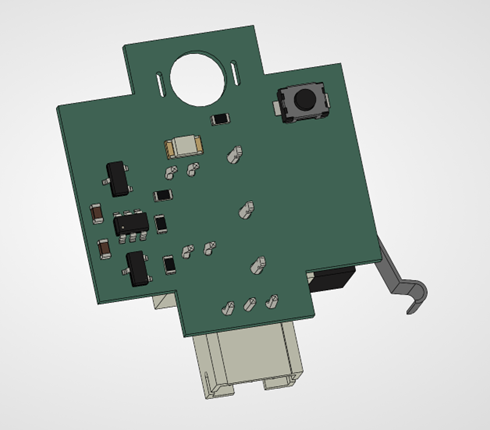  
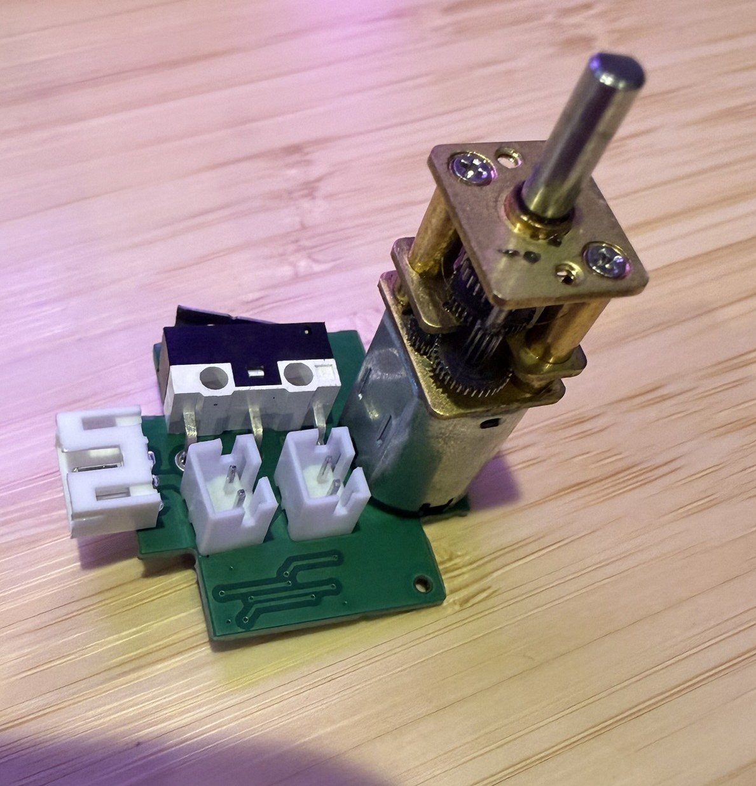  
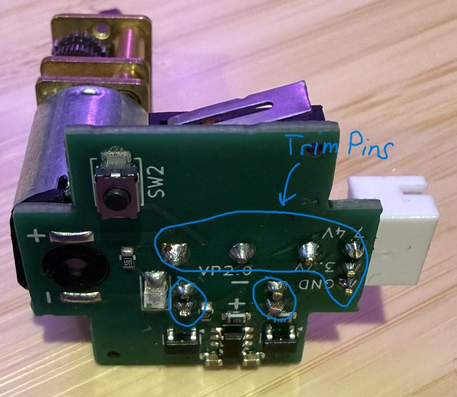   
Trim the Excess Pin Lenght from the Headers and Switch to avoid touching the cap  

6.	Plug the Batteries in the order labeled. **VERIFY THE POLARITY IS CORRECT.** It is critical that you do this correctly or risk harming the board. When disassembling, unplug the batteries in the reverse order (#2 first then #1). AGAIN, **DON’T PRESS THE BUTTON.**
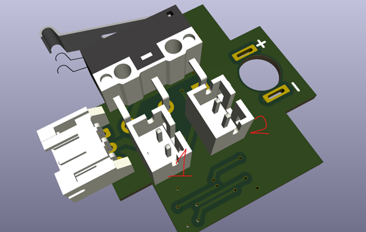

7.	Add the screw to the cam. Thread the set screw all the way through to remove additional material. Leave screw out until later. Verify the cam fits the motor shaft.  
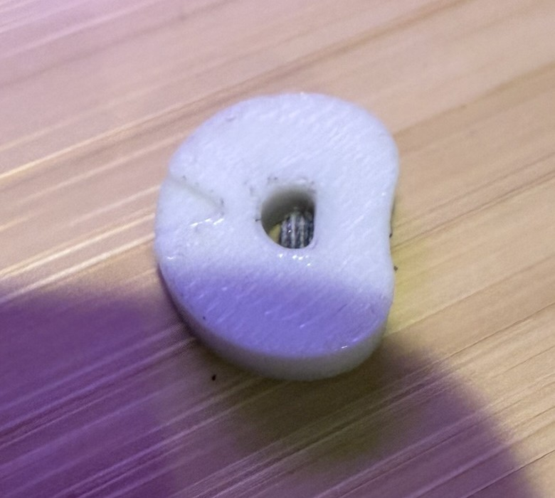

8.	Insert the PCB assembly and cam into the fuse. You can use a pin to hold the cam in the center like imaged below. Ensure the notch on the cam is facing down. Rotate the cam to match the motor shaft to insert fully. Ensure the battery wires are orientated as shown in the image and the wires are not being pinched. There is a small cutout for the wires under the switch.
  
Note the Pin inserted from the bottom holding the cam in place and the cam notch is facing down

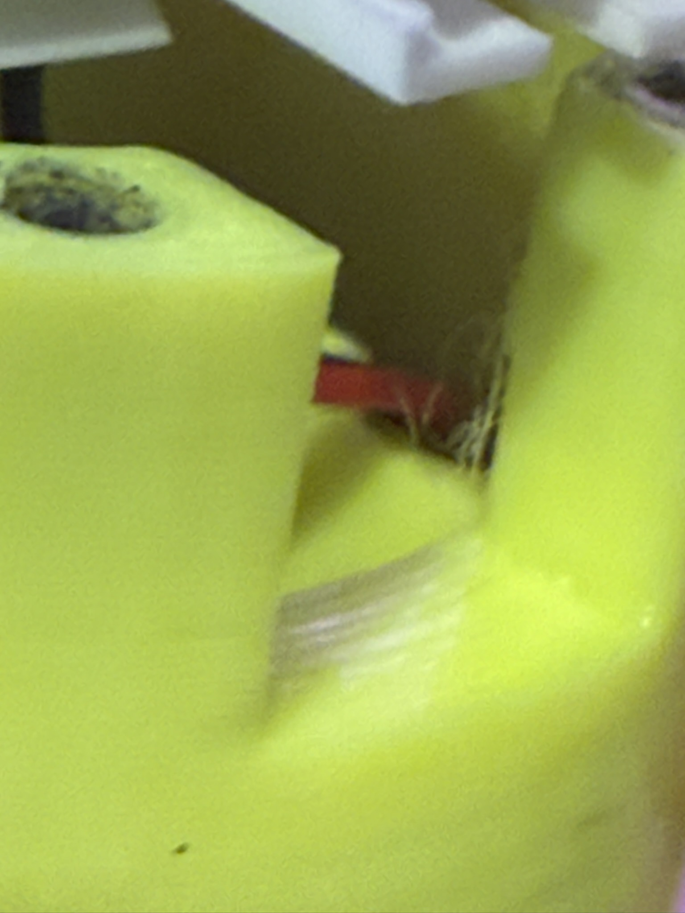  
Make sure the wires for the battery on the left are exiting through the cutout to prevent them from getting pinched by the switch  

  
Right Battery  

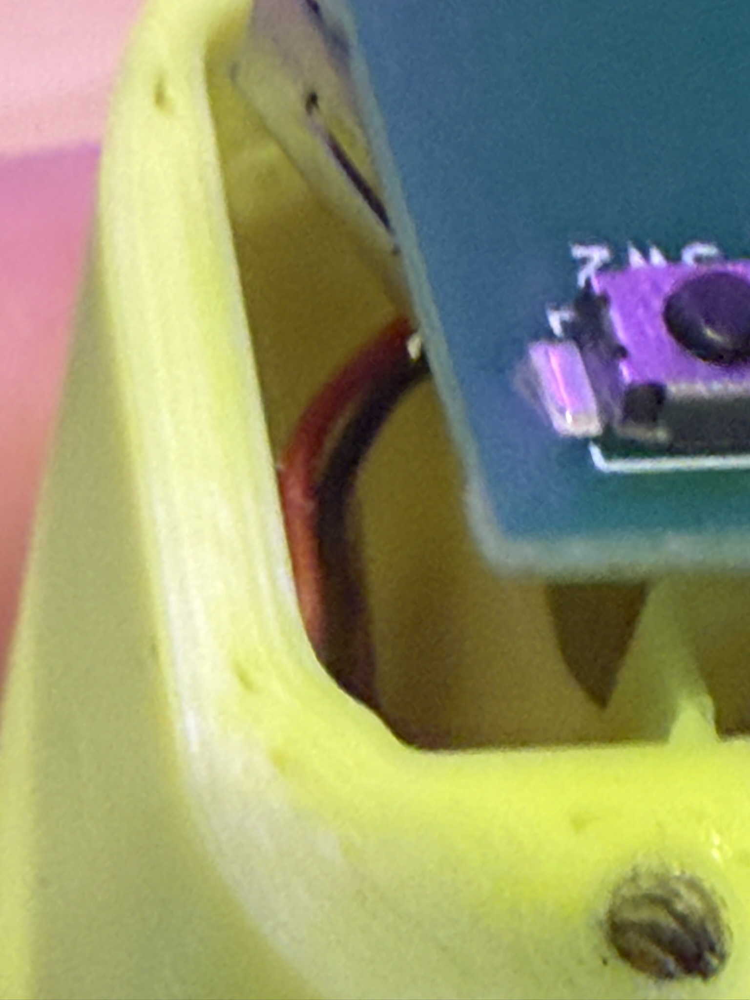  
Left Battery  

9. Now Fasten the printed switch lever and cap using 4 m2.5X25mm screws.  
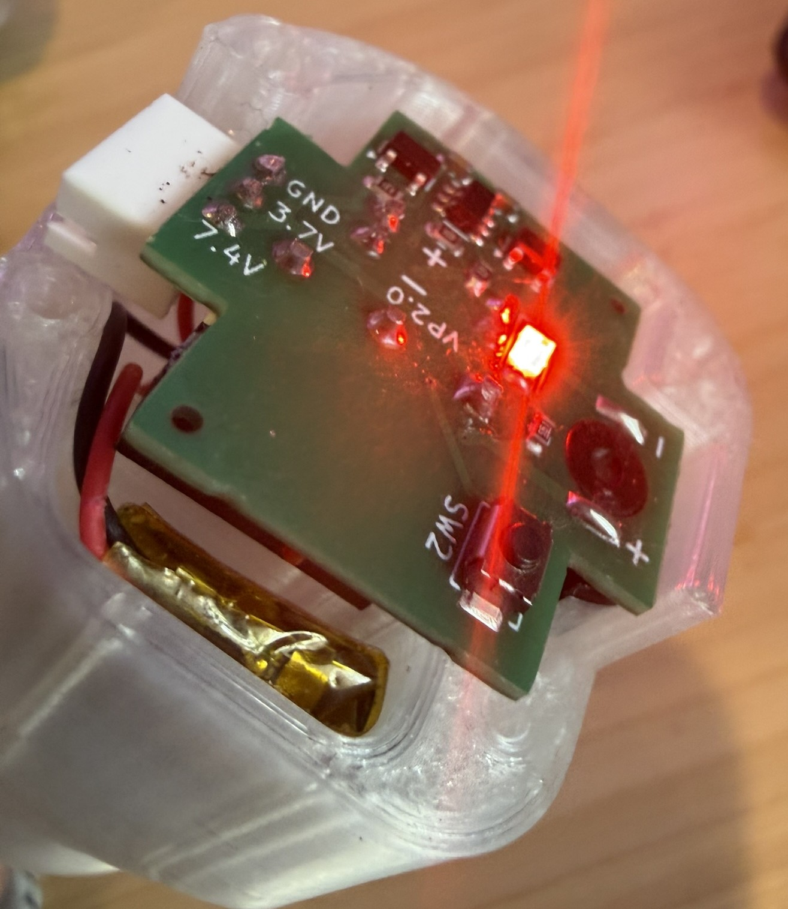  
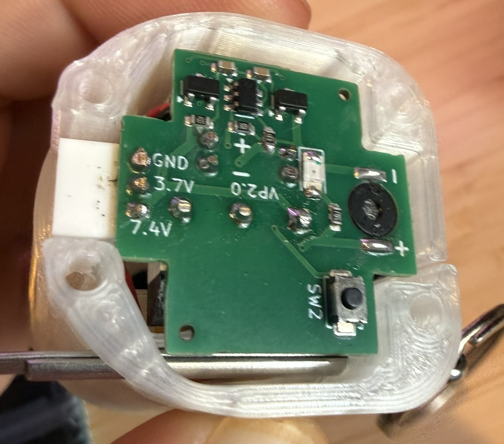  
  

9.	Now press the button to reset the battery protection circuit. The motor will now turn continuously if there is nothing pressing onto the switch. Stop the motor by inserting a pin to press the switch. If the board does not power, ensure that your batteries are charged and they were installed in the correct order and polarity. Fasten the cap once you confirm the motor is turning. Stop the motor when the cam is located with the set screw facing out. Install the set screw. Using superglue on the set screw is encouraged.
  

10.	Finally, to use the timed fuse stop the cam when the notch lines up with the arrow on the fuse body. Push the main bolt up and to the rear like you would the impact fuse. While holding it up and to the rear, advance the cam a small amount to catch or limit the bolt from falling. Now when the pin is pulled the cam will rotate and the bolt will eventually fall. The timing can easily be reduced by advancing the cam further when setting. Re-insert the pin to stop the mechanism upon retrieval.
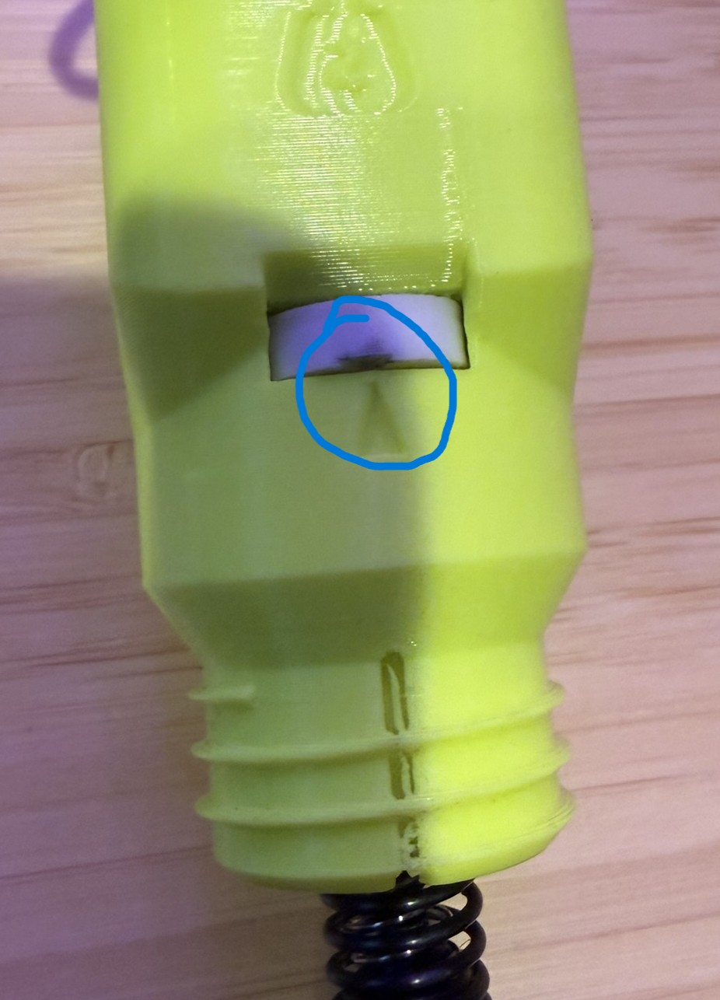  
Align the Cam Notch with the Arrow to Allow the Bolt to Move Up  

  
Note the Bolt is all the way up and the cam has been advanced preventing it from falling  

  

11.	To charge the fuse use a 2S Li-Po charger and the charging port on the side of the fuse. Below is a picture of a charging cable with labeled pins. Ensure that your wires are correct. There is a pinout on the PCB for further confirmation. If your charger requires you to plug in the main connector in addition to the balance lead, add two additional wires and a connector of your choice (Deans, jst, banana, etc.) like shown in green.
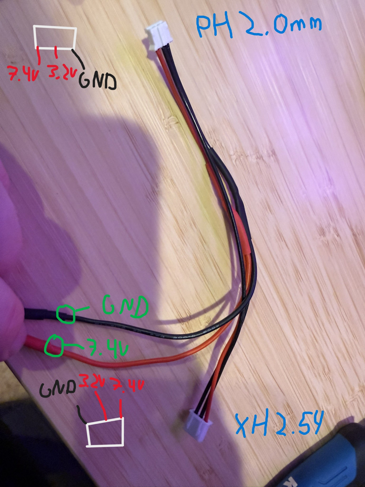

### Notes:
- The fuse will continuously spin until the switch is depressed with the pin.
- I measured over 1h 30min runtime. This is far more than I’ve ever needed and will allow you many uses given you retrieve it after throwing in a reasonable time.
- In case the batteries run out, the protection circuit will stop the batteries from being discharged further. Re-charge the batteries and reset the protection circuit with the button on top.
- If the motor spins freely in the cam, the D shaped hole becomes rounded, use glue when inserting the set screw. If the problem still occurs print the cam using a more rigid material such as a fiber reinforced material.  

# Body Assembly and Function:

### Primer Body:
The Primer will be loaded in the location outlined in the photo below. It can be pushed out after use from the bottom of the body. If the hole is not the right size, I suggest using x-y hole compensation in your slicer.  
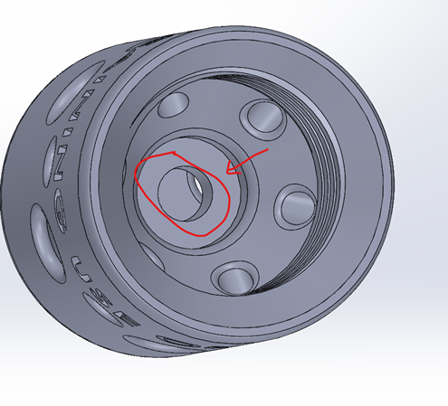  
  
Bambu Studio X-Y Hole Compensation  

### Multi-Primer Body
Insert the Holder into the body.  
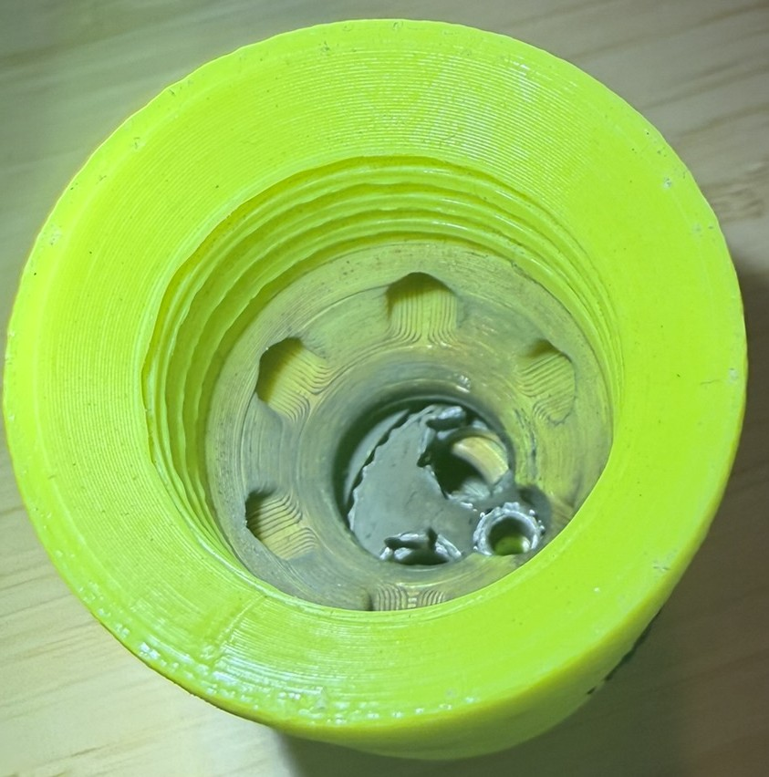  

Screw the holder Down. Do not tighten all the way. The Holder needs to be able to rotate.  
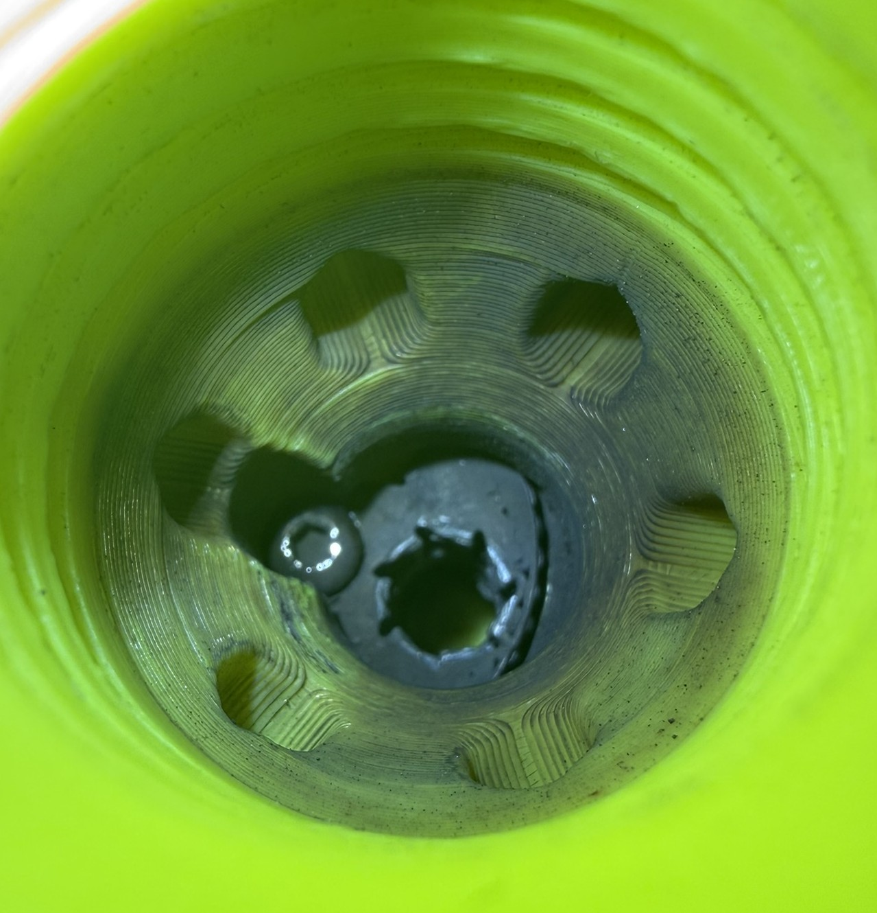  

Insert the ball bearing followed by the spring into the hole on the side. Insert the set screw to confine the spring and ball. Tighten until it becomed difficult to rotate the holder from position to position.  
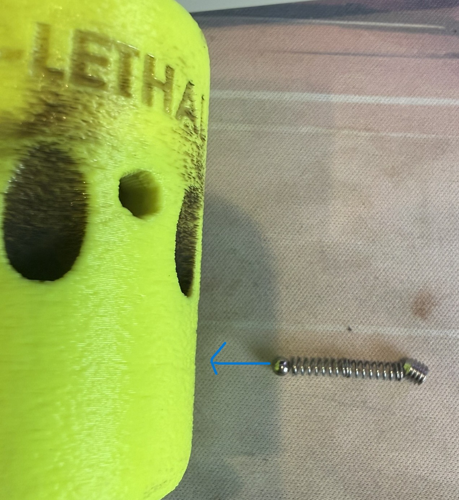  

### Cap Body:
The 8-shot cap can be placed over the retainer then placed in the body as seen below  
  

### Snap Body:
Remove the built in support  
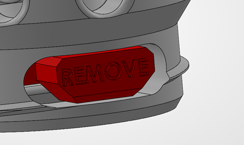  

Insert the snaps as shown  
  

The bottom can then be screwed on to secure the snaps from falling out  
  

# Additional Material Info:
Begin printing with TPU 72D, Nylon, PLA+ were applicable before experimenting with alternative materials. TPU 72D is a supperior material for impact resistance. Also, TPU is a safer body material. When a failure occurs TPU will tear rather than shatter like PLA+, Nylon, etc. When changing materials, modify only one variable at a time to accurately identify the source of any issues.  

## TPU 72D or Harder
Through testing, [CC3D 72D TPU](https://www.amazon.com/CC3D-Hardness-Transparent-Toughness-Comparable/dp/B0CFY1S38G/ref=sr_1_4?sr=8-4) has proven to be an excellent material choice. It offers an exceptional balance of rigidity, impact absorption, and layer adhesion. When printed correctly, parts made from this material are extremely durable. 

### Recomended Slicer Setting for CC3D 72D TPU
To achieve reliable results, use the following settings:
- Dry the filament thoroughly Like nylon and TPU, this material absorbs moisture aggressively.
- Outer wall speed: ≤ 40 mm/s
- Inner wall speed: ≤ 60 mm/s
- Seam position: Nearest

I also recomend annealing parts in boiling water for ~1 hour. This will stabalize its elastic carracteristics over a broader range of temperatures. It will also aid in layer adhesion.

## Nylon (Non-Fiber Reinforced)
Non-fiber-reinforced nylon is a significantly better alternative to PLA+. Use only raw nylon formulations, such as [Overture Easy Nylon]( https://www.amazon.com/OVERTURE-Filament-Consumables-Polyamide-Dimensional/dp/B087R3M9Z2/ref=sr_1_1_pp?sr=8-1), which offer superior impact absorption and stronger layer adhesion. For optimal performance, annealing printed nylon parts is strongly recommended. 

## Fiber-Reinforced Materials (Not Recomended)
Avoid fiber-reinforced filaments such as carbon fiber and glass fiber blends. While these materials increase rigidity, they also make parts significantly more brittle. Under impact, this high rigidity can cause parts to shatter rather than absorb energy. Additionally, fiber additives reduce layer adhesion, which is critical to the safe and reliable operation of these devices. The timer cam is the only component where increased rigidity is beneficial, as it helps prevent the motor shaft hole from rounding out. For this specific part only, a more rigid or fiber-reinforced material may be used.   
